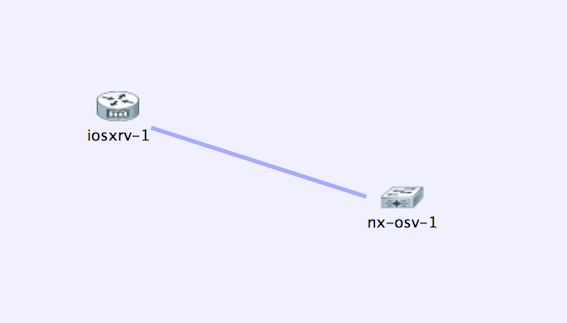

#NX-API Learning Lab

##Examples

* [show version](show_version.md)
* [show ip interface brief](show_ip_interface_brief.md)
* [show routing](show_routing.md)
* [show access lists](show_access_lists.md)
* [show cdp neighbors](show_cdp_neighbors.md)

##Topology

The examples use the topology contained in file [topology/NXandXR.virl](../topology/NXandXR.virl)
which looks like this 
